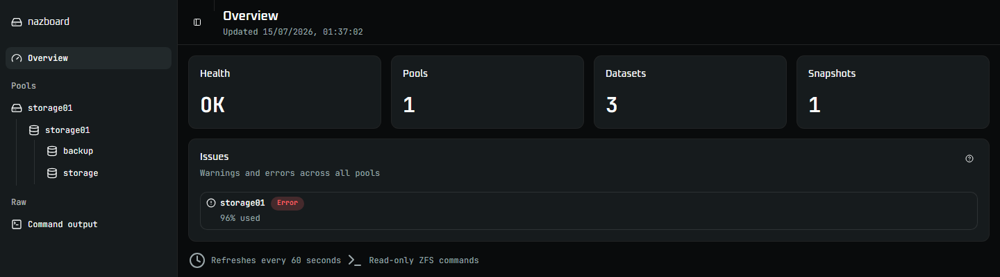
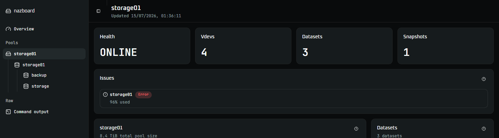
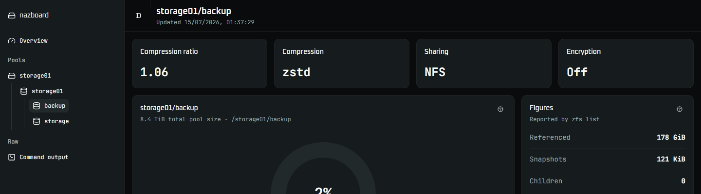

# nazboard

nazboard is a lightweight, read-only web dashboard for at-a-glance ZFS pool and dataset status.

It serves a Vite React UI built with shadcn/ui and a small TypeScript HTTP server on port `8080`. The server runs fixed `zpool`/`zfs` commands with Node built-ins and exposes status as JSON.

## Screenshots

### Overview



### Pool



### Dataset



## ZFS access caveat

nazboard reads ZFS status from the host kernel via `zpool` and `zfs`. The container image includes `zfsutils-linux`, but the host still needs working ZFS kernel support and the container must be able to access `/dev/zfs`.

## Local Docker usage

Build the image:

```sh
docker build -t nazboard:dev .
```

Run on a ZFS host:

```sh
docker run --rm \
  -p 8080:8080 \
  --device /dev/zfs \
  --read-only \
  nazboard:dev
```

Open <http://localhost:8080>. Health check endpoint: <http://localhost:8080/healthz>.

## API

`GET /api/status` returns the current read-only ZFS status:

- `overall`: health state and message
- `issues`: warnings and errors across commands, pools, and datasets
- `pools`: pool space usage, vdev/disk topology, nested dataset trees, and snapshots
- `commands`: diagnostic output from the fixed ZFS commands

Snapshot data comes from dataset `usedbysnapshots` totals, an exact,
tab-separated snapshot list containing `name`, `used`, `refer`, and `creation`,
and the consolidated property output. The dashboard uses these fixed commands:

```sh
zfs list -H -p -o name,used,avail,refer,mountpoint,usedbysnapshots
zfs list -H -p -t snapshot -o name,used,refer,creation
zfs get -H -p -t filesystem,volume,snapshot -o name,property,value,source all
```

The `zfs get` command omits dataset operands so OpenZFS returns every matching
dataset and snapshot in one invocation. nazboard groups those rows by the
`name` column before attaching properties to the corresponding objects.

OpenZFS defines a snapshot's `used` value as space unique to that snapshot.
Because blocks may be shared by snapshots, the dashboard uses
`usedbysnapshots` for the aggregate space that all snapshots of a dataset hold.

## Deployment beyond local Docker

If you run nazboard under an external orchestrator, provide equivalent container settings yourself: expose port `8080`, keep the filesystem read-only where possible, run as a non-root user, and pass through `/dev/zfs` so the bundled `zpool` and `zfs` tools can read host ZFS status. Some environments may require privileged container settings for ZFS device access.

## Security notes

- nazboard is read-only and exposes no forms or ZFS control endpoints.
- The web UI does not send pool or dataset identifiers to the server for command execution.
- Command execution uses fixed argument lists with `execFile`.
- Command output is returned as JSON and rendered by React as text.
- The container runs as UID/GID `10001` and supports a read-only root filesystem.
- Restrict network access to trusted administrators; nazboard does not implement authentication.

## Development

Install dependencies:

```sh
npm ci
```

Run tests:

```sh
npm test
```

Build the server and UI:

```sh
npm run build
```

Run locally after building:

```sh
npm start
```

Run locally with the redacted example output in `tests/` instead of calling `zpool` or `zfs`:

```sh
NAZBOARD_FIXTURE_DIR=tests npm start
```

To refresh those fixtures on a machine with ZFS pools, datasets, and snapshots,
run the shell script directly (Node.js is not required):

```sh
./scripts/generate-test-data.sh
```

The generator runs the same six fixed, read-only `zpool` and `zfs` commands as
the server and replaces the corresponding files in `tests/` only after every
command succeeds. It replaces leaf device paths and serial-based names in both
`zpool status` outputs with stable `disk-N` placeholders. To capture the files
elsewhere for review first, pass an output directory:

```sh
./scripts/generate-test-data.sh --output-dir /tmp/nazboard-test-data
```

Developers with Node.js installed can also use `npm run generate:test-data`.
Pass `--no-redact-device-names` only when the original device identifiers are
intentionally required.

Review and redact pool, dataset, and other host-specific names before committing
generated data from a real system.

For frontend-only development, run:

```sh
npm run dev
```

## Release and publishing

The GitHub Actions workflow in `.github/workflows/publish.yml` publishes container images to:

```text
ghcr.io/<owner>/nazboard
```

It runs on pushes to `main` and tags matching `v*.*.*`. Image tags include branch tags, SHA tags, semantic version tags, and `latest` for the default branch.

## License

nazboard is released under the MIT License. See [LICENSE](LICENSE).
