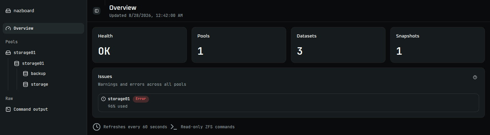
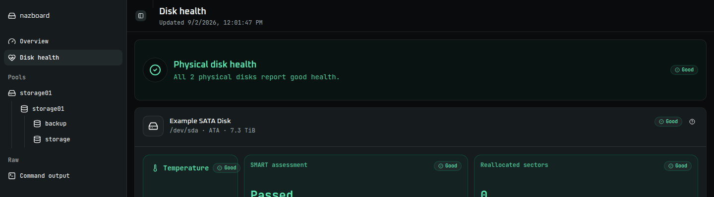
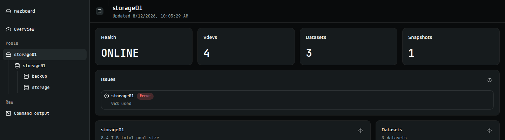
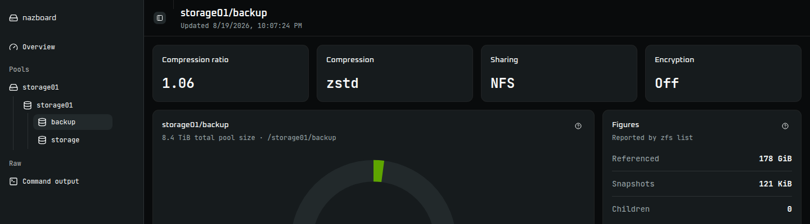

# nazboard

nazboard is a lightweight, read-only dashboard for monitoring ZFS pools,
datasets, snapshots, and physical disk SMART health from a browser. It highlights
problems that need attention while keeping healthy storage quiet and easy to
scan.

## Screenshots

### Overview



### Disk health



### Pool



### Dataset



## Run with Docker

nazboard runs on a Linux host with Docker. Pass through `/dev/zfs` for ZFS
monitoring and each physical disk you want SMART monitoring to include:

```sh
docker run --rm \
  --name nazboard \
  -p 127.0.0.1:8080:8080 \
  --device /dev/zfs \
  --device /dev/sda \
  --device /dev/nvme0 \
  --read-only \
  --cap-drop ALL \
  --cap-add DAC_OVERRIDE \
  --cap-add SYS_ADMIN \
  --cap-add SYS_RAWIO \
  --pids-limit 100 \
  ghcr.io/paulgallon/nazboard:latest
```

Replace the example disk paths with the disks available on your host, then open
<http://localhost:8080>. The container health check is also available at
<http://localhost:8080/healthz>.

ZFS and SMART monitoring can be used independently:

- For SMART only, omit `/dev/zfs` and add
  `-e NAZBOARD_ZFS_ENABLED=false`.
- For ZFS only, omit the physical disk devices and add
  `-e NAZBOARD_SMART_ENABLED=false`.

Device permissions vary between hosts. If the example cannot access ZFS or a
disk, check the permissions on the corresponding `/dev` path and adjust the
container settings for your system.

nazboard does not provide authentication or TLS and may display sensitive pool,
dataset, and disk identifiers. Keep it on a trusted network or place it behind
an authenticated HTTPS reverse proxy.

## License

nazboard is released under the [MIT License](LICENSE).
